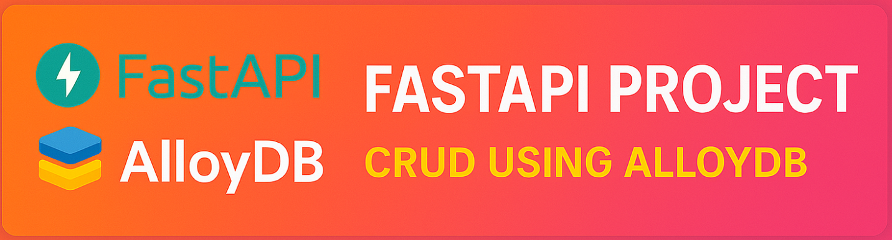

# FastAPI Layered Architecture with AlloyDB





In this project, I've gone through the journey of building a robust, scalable, and maintainable backend application that follows layering architecture principles. 
My aim in this project is to build an application that has clear separation of concerns (layers), centralized error handling, and asynchronous database communication with a PostgreSQL-compatible database like Google Cloud's AlloyDB.

### The Journey and Philosophy
My goal was not just to build an API, but to build it *correctly*. The modern development landscape is filled with powerful frameworks, but without a solid architectural foundation, projects can quickly become difficult to test, maintain, and scale. This project documents my journey in applying core software engineering principles to a FastAPI application.

The key philosophies are:
*   **Layering:** Strictly separating the API, business logic, and data access layers.
*   **Errors Handling:** Handling errors explicitly and predictably.
*   **Log Intelligently:** Logging provides visibility into the application's behavior, especially when things go wrong.
*   **Contracts are Key:** Using Pydantic to define clear, validated data structures for inputs and outputs.

## The Layers
This application is built on a classic 3-tier architecture, with a clear distinction between the Presentation, Service/Domain, and Data Access layers.

```
+---------------------------+
|   API / Presentation Layer|  (main.py)
|   - Handles HTTP          |
|   - Validates I/O         |
|   - Calls Service Layer   |
+---------------------------+
             |
             v
+---------------------------+
|       Service Layer       |  (services/book_service.py)
|   - Core Business Logic   |
|   - Orchestrates Data     |
|   - Calls Repository      |
+---------------------------+
             |
             v
+---------------------------+
|    Repository/Data Access |  (repositories/book_repository.py)
|   - Manages DB Queries    |
|   - Abstracts the DB      |
+---------------------------+
             |
             v
+---------------------------+
|         Database          |  (AlloyDB for PostgreSQL)
+---------------------------+
```

### 1. Presentation Layer (`main.py`)
This is the "front door" of our application. It is responsible for handling web requests and should be as "thin" as possible.

*   **Technology:** FastAPI.
*   **Responsibilities:**
    *   Defining RESTful endpoints (`@app.get`, `@app.post`, `@app.patch` and `@app.delete`).
    *   Using Pydantic models ('CreateBook', 'Book') to validate incoming request data and serialize outgoing responses.
    *   Parsing path parameters, query parameters, and request bodies.
    *   Delegating all work to the Service Layer. **The Presentatoin Layer does not contain business logic.**
    *   Mapping application-specific exceptions to appropriate HTTP status codes via `@app.exception_handler`.

### 2. Service Layer (`services/book_service.py`)
This layer contains the core business logic and orchestrates operations.


*   **Responsibilities:**
    *   Implementing the use cases of the application (e.g., `create_book`, `get_book_by_id`, etc).
    *   Performing business validation (e.g., checking if a book already exists before creation).
    *   Raising specific exceptions like `BookNotFoundError` when a business rule is violated or a resource isn't found.
    *   It is completely unaware of HTTP; it doesn't know about `Requests` or `JSONResponses`.

### 3. Repository Layer (`repositories/book_repository.py`)
This layer's sole purpose is to manage data persistence. It abstracts away the specifics of how data is stored and retrieved.

*   **Technology:** SQLAlchemy Core.
*   **Responsibilities:**
    *   Constructing and executing SQL queries.
    *   Connecting to the database and managing connections/sessions.
    *   Mapping database rows to our Pydantic data models.
    *   This separation is crucial for testability and flexibility. We can easily unit test our service layer by "mocking" the repository, and if we ever decide to switch from AlloyDB to a different data source, we only need to change the repository's implementation—the service layer remains untouched.

## Error Handling and Logging Strategy

A robust application anticipates failure. Our strategy is built on being explicit and informative.

1.  **Custom Exceptions (`common/exceptions.py`):**
    We define a base `AppError` and specific exceptions like `DatabaseConnectionError` and `BookNotFoundError`. This allows our code to express *why* something failed in a semantic way, rather than relying on generic `Exception` types.

2.  **Centralized Handlers (`main.py`):**
    FastAPI's `@app.exception_handler` is used to catch our custom exceptions. This handler translates a raised `BookNotFoundError` from the service layer into a clean, user-friendly `404 Not Found` JSON response. This decouples the business logic (raising an error) from the presentation logic (formatting an HTTP response).

3.  **Structured Logging (`utils/logger.py`):**
    We use Python's `logging` module to create a singleton logger.
    *   `logger.info()` is used for routine events like opening/closing DB connections.
    *   `logger.warning()` or `logger.error()` is used within exception handlers to record when something goes wrong.
    *   `logger.exception()` is used in the generic 500 handler to capture the full stack trace of unhandled exceptions, which is critical for debugging.

## Technology Stack

*   **Framework:** FastAPI
*   **Database:** AlloyDB for PostgreSQL (or any standard PostgreSQL)
*   **ORM/Query Builder:** SQLAlchemy (Core)
*   **Data Validation:** Pydantic
*   **Async Support:** `asyncio`, `uvicorn`, `asyncpg`
*   **Testing:** `pytest`, `pytest-asyncio`

## Project Structure

```
.
├── src
│   ├── common
│   │   └── exceptions.py       # Custom application exceptions.
│   ├── database
│   │   ├── connection.py       # DB connection logic.
│   │   └── schema.py           # SQLAlchemy table definitions.
│   ├── repositories
│   │   └── book_repository.py  # Data access logic.
│   ├── services
│   │   └── book_service.py     # Business logic.
│   ├── schema
│   │   ├── request.py          # Pydantic models for incoming data.
│   │   └── response.py         # Pydantic models for outgoing data.
│   ├── stubs
│   │   └── BOOKS_DATA.JSON     # Sample data.
│   ├── test
│   │   └── test_db_connection.py # Pytest tests.
│   ├── utils
│   │   ├── logger.py           # Centralized logger configuration.
│   │   └── result_mapper.py    # Utility for mapping data.
│   ├── main.py                 # FastAPI app, endpoints, exception handlers.
│   └── scripts
│       └── sql_scripts.sql     # DDL scripts for setting up the DB schema.
├── .env                        # Local environment variables (ignored by git).
├── .gitignore
└── README.md
```

## Setup and Installation

**1. Prerequisites:**
*   Python 3.12.10
*   An available PostgreSQL instance (local, Docker, or a cloud service like AlloyDB).

**2. Clone the Repository:**
```bash
git clone 
cd 
```

**3. Set up a Virtual Environment:**
```bash
poetry config virtualenvs.in-project true
poetry init
poetry env activate
```

**4. Install Dependencies:**
```bash
poetry install
```

**5. Configure Environment Variables:**
Create a file named `.env` :

Edit the `.env` file with your AlloyDB/PostgreSQL connection details. The URL format is:
```
postgres_async_url="postgresql+asyncpg://:@:/"
```

**6. Set up the Database:**
Connect to your database and run the scripts in `src/scripts/sql_scripts.sql` to create the schema and table.

## Running the Application

```bash
uvicorn src.main:app --reload
```
The API will be available at `http://127.0.0.1:8000`.

## Running Tests

```bash
pytom -m pytest -v
```

## API Endpoints
The API will be available at `http://127.0.0.1:8000/docs`.